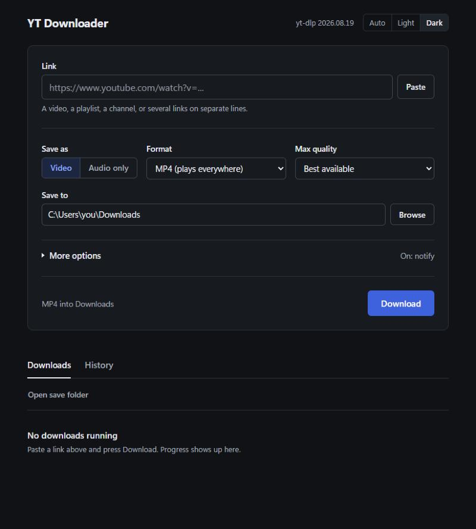

# YT Downloader

[](https://github.com/Ruytha/Youtube-Downloader/actions/workflows/ci.yml)

A Windows desktop app for saving YouTube videos and audio, built on [yt-dlp](https://github.com/yt-dlp/yt-dlp).
Paste a link, pick a format, press Download.



## Features

- **Video** as MP4, MKV or WebM, up to 4K, or **audio** as MP3, M4A, Opus, FLAC or WAV
- **Playlists and channels**: tick the videos you want from a checklist
- **Several links at once**: paste one per line; broken links are flagged
- **Clips**: save only part of a video by setting a start and end time
- **Subtitles**: embed them in the video or save them as `.srt` files
- **Music tags**: titles like "Artist - Song (Official Video)" are tagged as artist and title, with cover art
- **Download list** with progress, cancel and retry; up to 3 downloads run at once
- **History** of finished downloads, with a button to show each file in Explorer
- **yt-dlp updates** from inside the app when a new version is out
- **Windows notification** when the list finishes
- Light and dark themes, keyboard accessible

## Requirements

- Windows 10 or 11
- Python 3.10 or newer (not needed if you use the .exe from Releases)
- [FFmpeg](https://ffmpeg.org/) on your `PATH`, used to join video and audio and convert formats:

  ```
  winget install Gyan.FFmpeg
  ```

## Install and run

```
git clone https://github.com/Ruytha/Youtube-Downloader.git
cd Youtube-Downloader
pip install -r requirements.txt
python web_app.py
```

Or double-click `run.bat`. The app opens in its own window. If the window can't start, it opens in your browser instead.

| Command | What it does |
|---|---|
| `python web_app.py` | Opens the app window |
| `python web_app.py --browser` | Opens in your default browser instead |
| `python web_app.py --server` | Runs the server only, opens nothing (for development) |

## Download the .exe

Prebuilt versions are on the [Releases](https://github.com/Ruytha/Youtube-Downloader/releases) page. Unzip and run `YT Downloader.exe`. You still need FFmpeg installed, or `ffmpeg.exe` and `ffprobe.exe` placed next to the .exe.

To build it yourself, run `build.bat`. It creates `dist\YT Downloader.exe` and copies your FFmpeg next to it.

## How it works

`web_app.py` runs a small web server on `127.0.0.1:8765` that only accepts requests from its own page. The interface in `web/` is plain HTML, CSS and JavaScript with no build step. Downloads run in background threads through yt-dlp's Python API.

Download history is stored in `%APPDATA%\YTDownloader\history.json`. Your format and folder choices are remembered by the app window.

## Troubleshooting

**Downloads suddenly fail.** YouTube changes often. Use the update banner in the app, or run `pip install -U yt-dlp`, then restart the app.

**Some qualities are missing.** yt-dlp may need a JavaScript runtime for YouTube. Install [Deno](https://deno.com/) with `winget install DenoLand.Deno`.

**"ffmpeg not found".** Install FFmpeg (see Requirements) and open a new terminal so `PATH` updates.

## Development

```
pip install -r requirements-dev.txt
python -m pytest
python -m ruff check .
```

The tests run offline and never download anything. CI runs them on every push. Pushing a tag such as `v1.0.0` builds the .exe and publishes a release; the tag has to match `APP_VERSION` in `web_app.py`.

`yt_downloader.py` is the original minimal Tkinter version, kept as a fallback that needs no browser engine.

## Legal

This tool is for downloading content you have the right to download, such as your own uploads or videos under a Creative Commons license. Downloading other content may break YouTube's Terms of Service or copyright law where you live. You are responsible for how you use it.

This project is not affiliated with YouTube or Google.

## License

[MIT](LICENSE). The release .exe also bundles third-party packages under their own licenses, including yt-dlp (Unlicense), pywebview (BSD-3-Clause) and mutagen (GPL-2.0-or-later).
